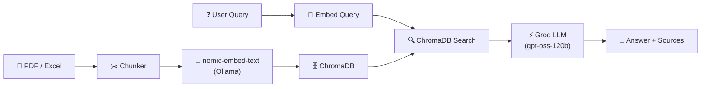

# RAG System — Complete Project Walkthrough

---

## Architecture




---

## Two RAG Applications

This project contains **two independent RAG applications**, each with its own ChromaDB collection, HTML UI, and Flask server.

| | **PRD RAG** (Port 5000) | **Test Case RAG** (Port 5001) |
|---|---|---|
| **Source** | VWO Login Dashboard PRD (PDF) | 100 Test Cases (Excel) |
| **Chunking** | 800 chars, 120 overlap | 1 test case = 1 chunk (natural) |
| **ChromaDB** | `./chroma_db/` | `./chroma_tc_db/` |
| **HTML** | `index.html` | `testcases.html` |
| **Script** | `rag_app.py` | `rag_testcases.py` |
| **Collection** | `vwo_prd_pdf_chunks` | `vwo_test_cases` |
| **Retrieval** | Semantic top-3 | Smart: module-filter or semantic top-5 |

---

## Tech Stack

| Component | Technology |
|-----------|-----------|
| **Embeddings** | nomic-embed-text via local Ollama |
| **Vector Store** | ChromaDB (local persistent) |
| **LLM** | openai/gpt-oss-120b via Groq API |
| **API Key** | `.env` file (python-dotenv) |
| **PDF Extraction** | PyPDF2 |
| **Excel I/O** | openpyxl |
| **Web Server** | Flask |

---

## Project Files

| File | Purpose |
|------|---------|
| [rag_app.py](file:///c:/Users/akank/OneDrive/Documents/All_abt_AI/RAG/rag_app.py) | PRD RAG backend — PDF ingestion, chunking, ChromaDB, Groq |
| [index.html](file:///c:/Users/akank/OneDrive/Documents/All_abt_AI/RAG/index.html) | PRD RAG frontend — pipeline viz, chunk explorer, Q&A |
| [rag_testcases.py](file:///c:/Users/akank/OneDrive/Documents/All_abt_AI/RAG/rag_testcases.py) | Test Case RAG backend — Excel ingestion, smart retrieval |
| [testcases.html](file:///c:/Users/akank/OneDrive/Documents/All_abt_AI/RAG/testcases.html) | Test Case RAG frontend — module pills, TC cards, Q&A |
| [generate_test_cases.py](file:///c:/Users/akank/OneDrive/Documents/All_abt_AI/RAG/generate_test_cases.py) | Generates 100 test cases → Excel |
| [.env](file:///c:/Users/akank/OneDrive/Documents/All_abt_AI/RAG/.env) | `GROQ_API_KEY` storage |
| `data/Product Requirements Document_ VWO Login Dashboard.pdf` | Source PRD document |
| `Test_Cases_VWO_Login.xlsx` | 100 enterprise test cases (8 modules) |
| `chroma_db/` | ChromaDB storage for PRD chunks |
| `chroma_tc_db/` | ChromaDB storage for test case chunks |

---

## How to Run

### Prerequisites
- **Ollama** running locally with `nomic-embed-text` pulled
- **Groq API key** in `.env` file

### PRD RAG (Port 5000)
```powershell
py rag_app.py
# Open http://localhost:5000
```

### Test Case RAG (Port 5001)
```powershell
py rag_testcases.py
# Open http://localhost:5001
```

Both can run simultaneously on different ports.

---

## RAG Pipeline (6 Steps)

Both apps show an animated pipeline bar in the UI:

```
❓ User Query → 🧠 Embed (Ollama) → 🔍 ChromaDB Search → 📎 Top-K Chunks → ⚡ Groq LLM → 💬 Answer
```

1. **User Query** — User types a question
2. **Embed Query** — nomic-embed-text via local Ollama
3. **ChromaDB Search** — Cosine similarity against stored vectors
4. **Top-K Retrieval** — Most relevant chunks returned
5. **Groq LLM** — Chunks + question sent to gpt-oss-120b
6. **Answer + Sources** — Response with source chunk IDs and similarity scores

---

## Smart Retrieval (Test Case RAG)

The Test Case RAG has an enhanced retrieval strategy:

- **Module detection** — If the query mentions a module keyword (e.g., "password", "SSO"), it uses ChromaDB's `where` metadata filter to retrieve **ALL** test cases from that module
- **Semantic fallback** — For general queries, uses standard top-5 cosine similarity
- **Stats context** — The LLM always receives module/category/priority counts so it knows dataset totals

---

## Test Case Coverage

| Module | Count |
|--------|-------|
| Login Authentication | 20 |
| Password Management | 15 |
| Session Management | 10 |
| Input Validation | 13 |
| SSO Integration | 12 |
| UI/UX Design | 12 |
| Accessibility | 10 |
| Security | 8 |
| **Total** | **100** |

| Category | Count |
|----------|-------|
| Positive | 43 |
| Negative | 35 |
| Edge Case | 17 |
| Boundary | 5 |

---

## Key Features

- **ChromaDB caching** — Embeddings persist; subsequent runs skip re-embedding
- **PDF + Excel support** — PRD from PDF, test cases from Excel
- **Pipeline visualization** — Animated step-by-step in UI header
- **Module filter pills** — Click to filter test cases by module (Test Case RAG)
- **Expandable cards** — Click to reveal steps/expected/preconditions
- **Source attribution** — Every answer shows which chunks/TCs were used with similarity %
- **Dual servers** — Both RAGs run independently on ports 5000 and 5001

---

## Dependencies

```
flask
chromadb
requests
python-dotenv
PyPDF2
openpyxl
```

Ollama must be running locally with `nomic-embed-text` model.
